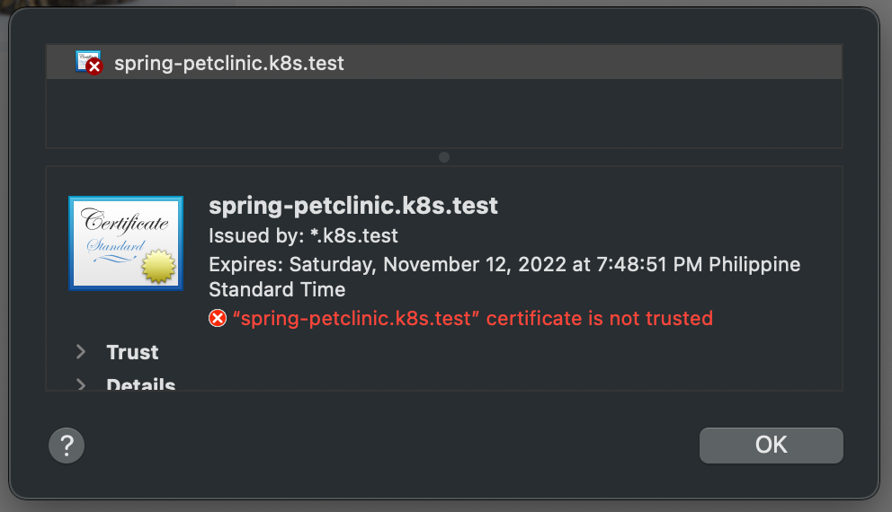

# Web app with TLS

The sample application used, Spring PetClinic, is from <https://github.com/spring-projects/spring-petclinic/tree/3f8468432d86dcbd0cf4372e93e06d2f47aed26a>.

## Required tools

- Minikube
- VirtualBox
- Kubectl
- Helm
- Openssl

## Set up a local K8s cluster with Minikube

```bash
minikube start --driver=virtualbox

# the ingress-dns addon is necessary so that we can access local DNS names without editing /etc/hosts
minikube addons enable ingress-dns

sudo bash -c "cat <<EOF > /etc/resolver/minikube-test
domain test
nameserver $(minikube ip)
search_order 1
timeout 5
EOF"
```

## Build the Docker image

```bash
# I would have liked to use "docker -v <host path>:<container path> ..." here but Minikube does not support mounting the host's file system using this method
# there is a "minikube mount" command but that requires changes to your local machine's firewall
scp -i $(minikube ssh-key) -r spring-petclinic docker@$(minikube ip):/home/docker/spring-petclinic

# due to frequent OOM errors when using multi-stage builds, the application is compiled to a JAR file in the Minikube VM's file system first before building the actual image
minikube ssh "docker run --rm -v /home/docker/spring-petclinic:/spring-petclinic -w /spring-petclinic maven:3.8.6-eclipse-temurin-17-alpine sh -c 'mvn clean package'"

minikube ssh "docker build spring-petclinic -t minikube/spring-petclinic:2.7.0"
```

## Deploy the application and DB

```bash
kubectl apply -f k8s/manifests
kubectl apply -f k8s/manifests/db
kubectl apply -f k8s/manifests/app
```

### Check if the application is working

```bash
kubectl -n spring-petclinic port-forward svc/spring-petclinic 8080:80
```

Open <http://localhost:8080> in your browser. You should see a puppy and a kitten.

## Deploy ingress-nginx

```bash
helm repo add ingress-nginx https://kubernetes.github.io/ingress-nginx

helm repo update

helm install ingress-nginx ingress-nginx/ingress-nginx --namespace ingress-nginx --create-namespace -f k8s/helm/ingress-nginx/values.yaml --set-string controller.service.externalIPs={$(minikube ip)}
```

Visit <http://spring-petclinic.k8s.test>. You should still be able to see a puppy and a kitten.

## Deploy cert-manager

```bash
helm repo add jetstack https://charts.jetstack.io

helm repo update

helm install cert-manager jetstack/cert-manager --namespace cert-manager --create-namespace --set installCRDs=true
```

### Create a self-signed certificate

```bash
# on MacOS, it is required to supply the correct config to OpenSSL because its default config does not create a valid CA. This issue is outlined here https://github.com/cert-manager/cert-manager/issues/279
openssl req -x509 -new -nodes -keyout .certs/k8s-test.key -subj "/CN=*.k8s.test" -days 365 -reqexts v3_req -extensions v3_ca -out .certs/k8s-test.crt -config /usr/local/etc/openssl@1.1/openssl.cnf

kubectl -n cert-manager create secret tls k8s-test-tls --key .certs/k8s-test.key --cert .certs/k8s-test.crt
```

### Create a ClusterIssuer

```bash
kubectl apply -f k8s/helm/cert-manager

# the ClusterIssuer should be ready before proceeding
kubectl get clusterissuers.cert-manager.io
```

### Update the ingress to use TLS

Uncomment lines 11-14 in `k8s/manifests/app/ing.yaml`

```bash
kubectl apply -f k8s/manifests/app/ing.yaml

# the certificate should be issued before proceeding
kubectl -n spring-petclinic get certificates.cert-manager.io
```

Go to <https://spring-petclinic.k8s.test>. You should encounter a security warning since the root certificate is not present in your machine's certificate store.

On Google Chrome, a way to bypass this warning is by typing `thisisunsafe` anywhere on the web page.

The TLS certificate should be signed by the self-signed certificate as shown by the issuer's common name: `*.k8s.test`


